# Drużyna z Dereth

Drużyna bohaterów, którzy począwszy od walki z królikołakiem, a obecnie na walce ze złowrogimi nekromantami kończąc przemierzają Królestwo Valinoru w poszukiwaniu chwały, zysku a niektórzy i celu.

## Bohaterowie

- [Ariel](Ariel.html)

- [Baldwin](Baldwin.html)

- [Blokus Maximus](Blokus_Maximus.html)

- [Wulfhart](Wulfhart.html)

- [Nemmonis Akra](Nemmonis_Akra.html)

- [Dagan](Dagan.html) (NPC)

## Historia kampanii

### Akt I

#### Sesja 0

##### *"KAŻDA DOBRA HISTORIA ZACZYNA SIĘ W KARCZMIE"*

###### *Porzekadło*

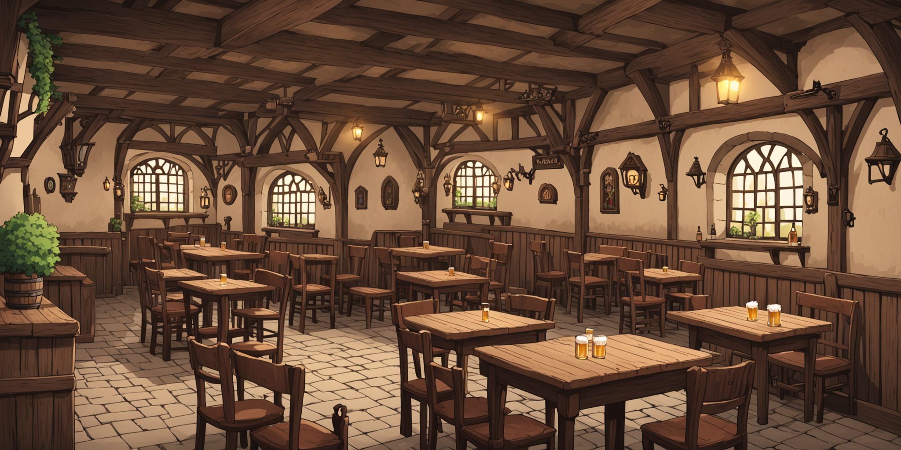

<audio controls>
  <source src="Audio/Sesja_0.mp3" type="audio/mpeg">
  Twoja przeglądarka nie obsługuje elementu audio.
</audio>

Rozpoczęliśmy niedawno kampanię w uniwersum fantasy na systemie Dungeons & Dragons. Naszymi bohaterami są czterej śmiałkowie:

Blokus Maximus, były gladiator i upadły paladyn, próbuje zgromadzić wiedzę na temat nekromancji w celu wskrzeszenia swojego ojca.

Baldwin, półelf, czynny członek gildii złodziei, chce okraść każdego bogatego władcę.

Ariel, elfka czystej krwi, łowczyni, chce doprowadzić do pokoju pomiędzy jej ludem a smokami.

Wulfhart, krasnolud, łowca. Jego rodzina została zabita przez potężnego nekromantę Von Vanta. Jego celem jest zemsta.

#### Sesja 1

##### *"HOKUS POKUS, MAG, ŻYWIOŁAK, W LESIE MIESZKA KRÓLIKOŁAK"*

###### *Bard Olivier z Dereth*

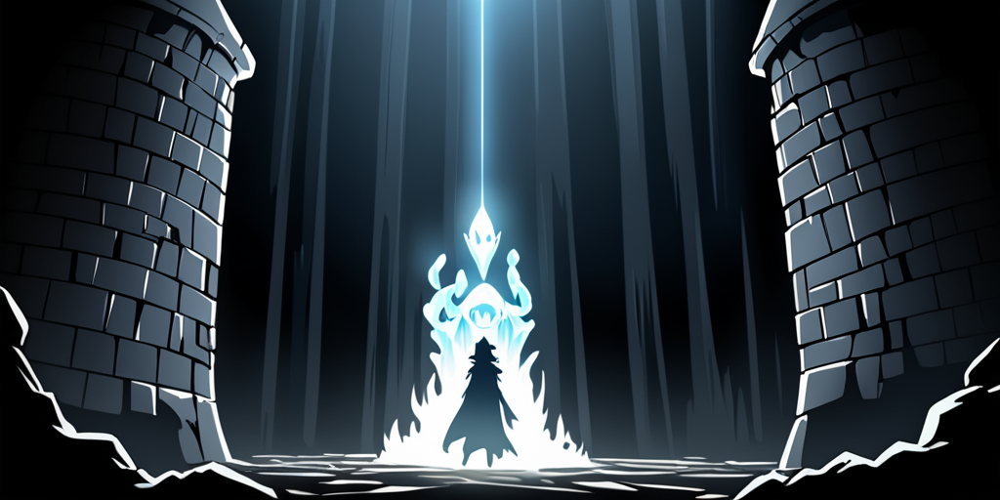x

<audio controls>
  <source src="Audio/Sesja_1.mp3" type="audio/mpeg">
  Twoja przeglądarka nie obsługuje elementu audio.
</audio>

Na pierwszej sesji Blokus odbył starcie z żywiołakiem światła w miejskich kanałach. Przy okazji poznał czarodzieja Merendira.

Wulfhart spędzał czas w tawernie oraz usilnie próbował skontaktować się z czarodziejem Merendirem, właścicielem wieży ciepłowniczej.

Ariel wykonywała zadania dla gildii elfów. Otrzymała również zlecenie odnalezienia elfiego dziecka, które zaginęło w lesie.

Baldwin kradł, jak na złodzieja przystało, oraz ćwiczył się w umiejętnościach skradania. Wielokrotnie szpiegował również pozostałych bohaterów.

Bohaterów połączył cel pokonania królikołaka, bestii, którą Ariel namierzyła w lesie. Gildia elfów wyznaczyła za potwora nagrodę, którą drużyna postanowiła zdobyć wspólnie.

#### Sesja 2

##### *"STYPA, STYPA I PO STYPIE, TYP BIŁ TYPA I PO TYPIE..."*

###### *Bard Olivier z Dereth*

<audio controls>
  <source src="Audio/Sesja_2.mp3" type="audio/mpeg">
  Twoja przeglądarka nie obsługuje elementu audio.
</audio>

Po pokonaniu królikołaka drużyna odkryła straszną prawdę. Poszukiwane dziecko zostało pożarte przez potwora. Gildia Elfów zorganizowała stypę, na której Blokus oraz Wulfhart nieźle się napili.

Baldwin oraz Ariel wyszli bez szwanku z popijawy. Ariel została wezwana do gildii na rozmowę wraz z Baldwinem. Szef gildii elfów wyrzucił ją z organizacji wściekły, że elfie dziecko zginęło. Zaoferował Baldwinowi, że odsprzeda mu prawa członkowskie Ariel, czyli de facto ją sprzedał. Baldwin ją kupił, co postawiło Ariel w pozycji sługi i finansowego dłużnika złodzieja.

Co do Blokusa... Cóż, jego eskapady będą łatwiejsze do opisania. Po pijaku zaatakował siedzibę burmistrza oraz uprawiał miłość z jego córką (niezbyt urodziwą) na dachu rezydencji możnowładcy. Obudził się w celi. Następnie w tawernie otrzymał propozycję zagrania w sztuce... opartej na własnych doznaniach alkoholowych i bójce...

Wulfhart obudził się w lesie po upojnej nocy z [Dredzikiem](Dredzik.html), elfką-piratką, która zaprosiła go do pirackiej siedziby... gdzie jak się okazało, miał już znajomości... lecz o nich nie pamiętał wskutek 'zerwania filmu'. Po wizycie u piratów nasz krasnolud został przez nich wysłany do czarodzieja Merendira, gdzie przy okazji rozmowy o interesach odbył wędrówkę wewnątrz własnej świadomości, próbując odnaleźć znienawidzonego nekromantę.

#### Sesja 3

##### *"NIGDY SIĘ TAK NIE ZESRAŁEM, JAK WTEDY W MIESZKANIU WICEMERA..."*

###### *Roland, strażnik miejski*

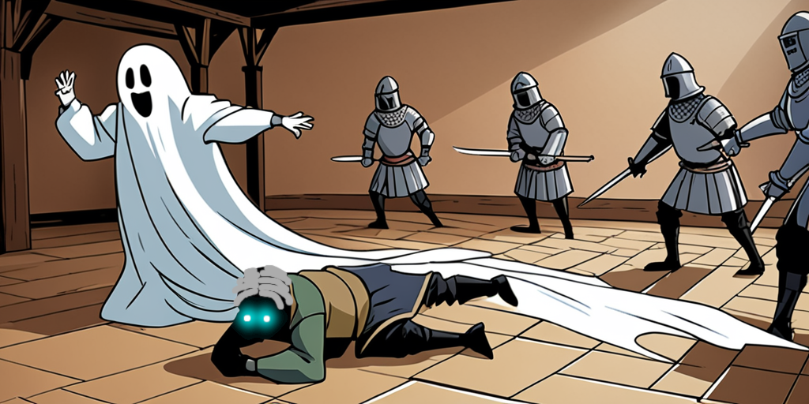

<audio controls>
  <source src="Audio/Sesja_3.mp3" type="audio/mpeg">
  Twoja przeglądarka nie obsługuje elementu audio.
</audio>

Na trzeciej sesji Blokus powrócił do swojego mieszkania i zastał je całkowicie zdemolowane, a miecz jego zmarłego wujka został skradziony. Dodatkowo sąsiad, zastępca burmistrza, zaczął znów grać na tych irytujących dudach. Blokus poszedł do niego i wyraził swoje niezadowolenie. Dodatkowo, unikając przyczajonego snipera miejskiego oraz walcząc ze strażnikami, którzy jednak zadali mu niesamowicie duże obrażenia, prawie umarł, wchodząc w sferę astralną, gdzie spotkał swoją rodzinę i wezwał ducha swojego wuja do walki ze strażą. Strażnicy tak się przestraszyli po tym, jak duch zaszlachtował jednego z nich, że uciekli w popłochu.

Rannego Blokusa znaleźli Ariel i Baldwin. Ariel opatrzyła jego rany, a Baldwin przeszukał mieszkanie.

Wulfhart natomiast udał się do piratów, aby oznajmić im, że umówił ich z Merendirem na spotkanie. Sam natomiast udał się do miejskiego sklepu z magicznymi stworzeniami, gdzie zakupił świetlistego ptaka znającego parę języków i emitującego aurę pozytywnej magii.

Ponieważ Blokus był poszukiwany, Ariel i Baldwin wybrali drogę przez miejskie kanały, gdzie znaleźli wielki posąg gargulca opatrzony tajemniczymi runami. Gdy znaleźli wyjście z kanałów na rynku głównym, spotkali Wulfharta. Tam również spotkali zarządcę teatru Gotorna, który zaproponował Blokusowi główną rolę w sztuce o nim samym.

Bohaterowie udali się na sztukę Blokusa, podczas której po wspaniałej grze aktorskiej oraz kilku wstydliwych scenach, nastąpiła burda rozpoczęta poprzez rzucenie w i tak już rannego zastępcę karłem przebranym za małą mumię. Baldwin okradł przy okazji kilka osób, dostał w pysk, a Wulfhart obił parę mord. Z opresji wybawił ich Blokus, który używając teatralnej liny scenograficznej niczym Tarzan wyrwał przyjaciół z opresji. Blokus otrzymał zapłatę za swoją grę, Baldwin za swoje skradzione drobiazgi, a Ariel nadal zastanawiała się, jak wyjść z zadłużenia i niewoli łotrzyka.

#### Sesja 4

##### *"ᛣᚢᚹ.ᛋᛚᚺᚴ ᚴᛅᚢᛊᛋ ᛬ᚢ᛬ ᛕᛏᛜᛉ᛫ᛜᛉᛋ ᚹᛏᚢᛩ.ᚺᛒ"*

###### *Inskrypcja z posągu gargulca pod Dereth*

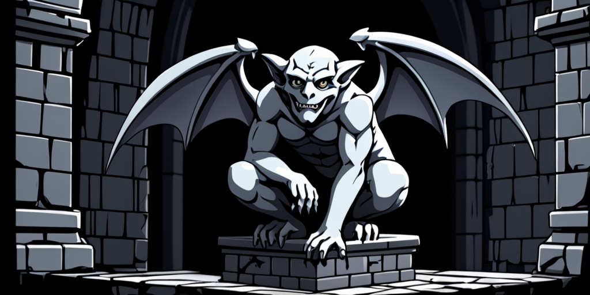

<audio controls>
  <source src="Audio/Sesja_4.mp3" type="audio/mpeg">
  Twoja przeglądarka nie obsługuje elementu audio.
</audio>

Na czwartej sesji czarodziej Merendir dogadał się z kapitanem piratów odnośnie swojego udziału w wyprawie przeciwko nekromancie, który zniszczył statek piratów. Drużyna postanowiła dołączyć do wyprawy i opuścić miasto Dereth, aby wyruszyć za Czternaste Wzgórze, gdzie znajduje się port, w którym reszta załogi piratów czeka na sprowadzenie potężnego maga. Blokus ma nadzieję na ograbienie nekromanty z wiedzy magicznej, Baldwin z pieniędzy, a Ariel musi jechać z Baldwinem, ale skrycie ma nadzieję na spotkanie po drodze smoków i nawiązanie z nimi kontaktu.

Podczas postoju w lesie bosman zaczął się skarżyć na ból w nodze, czarodziej zaś zaoferował mu swoją pomoc, a Wulfhart postanowił się zgłosić jako towarzysz maga. Wulfhart i Merendir udali się do lasu, gdzie rozdzielili się w poszukiwaniu ziół na maść przeciwbólową.

Ariel i Baldwin postanowili pół godziny później udać się do lasu w poszukiwaniu maga i krasnoluda, a Blokus zdecydował się zostać i oddać się medytacji, gdyż paskudne ptaszysko dobrej energii zostało zabrane przez Wulfharta i nie mogło już zakłócać jego astralnych wędrówek. Po odbytej medytacji Blokus zajął się piciem i hazardem z bosmanem, ucząc się przy okazji gry w kościanego pokera.

Wulfhart znalazł w lesie opuszczone gniazdo jaszczuropodobnej istoty niedaleko kwaśnego potoku, jednak postanowił wrócić do obozu, by nie ryzykować samotnego starcia z potworem. Po drodze spotkał Ariel, która wcześniej rozdzieliła się z Baldwinem na rozdrożu. Postanowili razem ruszyć śladami zwierzęcia. W tym czasie Baldwin, tropiąc maga, znalazł ślad wypalonej trawy. Nie znajdując nic więcej, ruszył, skradając się za Ariel i Wulfhartem. Ariel i Wulfhart, idąc śladem kwaśnej rzeczki, dotarli do kwasowej jaskini Jaszczura. Wewnątrz znaleźli zmutowanego jaszczura odpornego na kwas oraz jego młode. Za pomocą swoich umiejętności łowcy dokonali na jaszczurze zaklinania zwierząt, a Wulfhart uwięził zwierzę w magicznej kuli, którą kupił w sklepie zoologicznym.

Po powrocie do obozu Baldwin wypytywał czarodzieja o wypalony ślad w trawie, jednak mag nie był chętny do dzielenia się swoimi tajemnicami. Wyjaśnił jednak Baldwinowi inskrypcję z gargulca w kanałach. Baldwin zrozumiał, że oznacza to, że w podmokłych tunelach zaatakowali zabytek klasy zero.

#### Sesja 5

##### *"ZABIŁEM W ŻYCIU WIELE WĄPIERZY, ALE NIGDY NIE WIDZIAŁEM, ABY KTOŚ PRZECINAŁ JE STALĄ NA PÓŁ"*

###### *Krispian, starszy chorąży straży miejskiej*

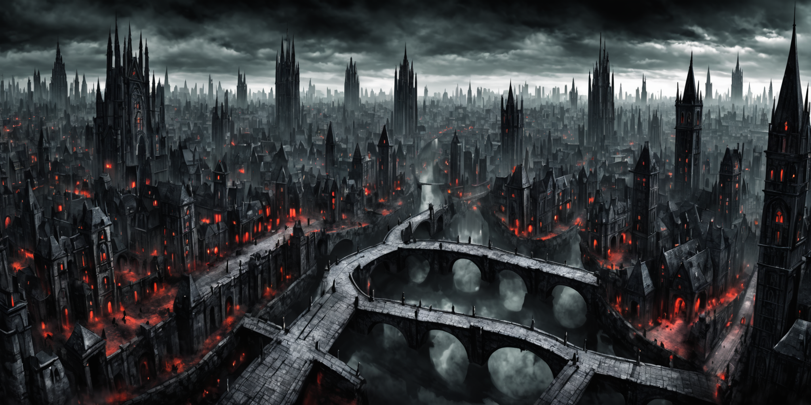

<audio controls>
  <source src="Audio/Sesja_5.mp3" type="audio/mpeg">
  Twoja przeglądarka nie obsługuje elementu audio.
</audio>

Po przygodach w lesie nasi bohaterowie stanęli u bram Vederoth, miasta znanego przede wszystkim ze swojego strzelistego budownictwa oraz niezliczonej ilości kamiennych mostów łączących kamienice mieszkalne. Wielu mieszkańców woli tam przechadzać się mostami niż przemieszczać się po zatłoczonych ulicach. Oczom bohaterów ukazała się piękna brama miejska, przez którą wjeżdżały i wyjeżdżały bogate powozy i szykowni kupcy. Po wjeździe do miasta okazało się jednak, że brama wjazdowa rozpłynęła się w powietrzu, a miasto spowite jest wieczną nocą, rozświetlaną jedynie przez przemykający między chmurami księżyc i uliczne latarnie, nerwowo zapalane przez latarników. Ulice były w większości puste. Od przypadkowych przechodniów oraz komendanta straży miejskiej Vincenta Meisa bohaterowie dowiedzieli się, że miasto od 5 lat spowija ciągły mrok, mury nie pozwalają nikomu wejść ani wyjść z miasta, a dookoła murów znajduje się tzw. "żywe cmentarzysko" pełne ożywieńców. Ponadto Meis nadmienił jeszcze, że metropolia nękana jest przez plagę wąpierzy. Kapitan straży miejskiej poprosił Baldwina, aby bohaterowie złożyli mu jutro wizytę wraz ze swoim magiem...

Nie wiedząc co o tym myśleć, bohaterowie udali się do pobliskiej karczmy, gdzie zasięgnęli języka u karczmarza oraz wynajęli pokoje w celu odetchnięcia. Kapitan Piratów postanowił jednak, że zorganizuje biesiadę w powozie, gdyż nie wierzy w wampiry i inne plugastwo. Wolfhard poprosił go jednak, aby zorganizował warty, tak na wszelki wypadek. Krasnolud stanął na pierwszej warcie. Wszystko wydawało się spokojne, gdy nagle zza rogu ulicy wyskoczył wąpierz. Kapitan w akcie paniki kazał wszystkim wskakiwać do wozu i zabić go od środka. Wąpierz nie dał jednak za wygraną i próbował otworzyć krwistą puszeczkę.

Z dachu całą akcję obserwował Baldwin, który postanowił rzucić się na wąpierza. Po epickiej walce półelf rozpłatał potwora na pół, ku wielkiemu zdziwieniu straży miejskiej. Wulfhard z całego serca chciał pomóc przyjacielowi, jednak gdy udało mu się odłupać dwie deski i wydostać na zewnątrz, już dawno było po walce. Kapitan zganił go ostro za ten czyn i zagroził wyrzuceniem z załogi, jeśli takie akcje powtórzą się w przyszłości... Zaczynało być jasne, że piraci, choć z pewnością nieustraszeni na morzu, w obecnej sytuacji sparaliżowani są strachem...

Kapitan piratów zarządził postój w karczmie, karząc jednocześnie Wulfharta spać na dole wraz z biedakami przy kominku. Ariel wpadła na pomysł, aby odwiedzić Dredzika w celu udania się na babskie pogaduchy, jednak jedyne, co tam znalazła, to libacja, hazard i pijackie podrywy bosmana. Nie spodziewała się nigdy, że ma tak mocną głowę...

Zgodnie z wcześniejszą umową z kapitanem straży, Baldwin, Ariel i czarodziej Merendir udali się do koszarów na rozmowę z kapitanem Vincentem. Ku ich zdziwieniu czarodziej zażądał rozmowy prywatnej z kapitanem, a po fakcie szybko opuścił Ariel i Baldwina, tłumacząc się sprawami czarodziejów. Po własnej rozmowie z kapitanem półelfio-elfia drużyna dowiedziała się co nieco o sytuacji w mieście i została poproszona przez kapitana o zinwigilowanie pewnego miejskiego przyjęcia zwanego "maskaradą", przewodzonego przez niejakiego "mistrza ceremonii" na najwyższym piętrze najwyższego budynku w mieście, zwanego Wieżą Arystokratów. Meis obiecał bohaterom sowitą nagrodę za wszelkie pożyteczne informacje. Baldwin i Ariel podjęli się zadania...

Jakiś czas później Blokus Maximus postanowił po odbytej medytacji zamienić słowo z Merendirem, jednak jedyne, co zastał w jego pokoju, to małego golema od herbaty i otwarty magiczny portal. Nie zdecydował się jednak przekraczać świetlistej bramy i udał się na dół, gdzie spotkał przy stoliku tajemniczego Dagana, który zaproponował jemu i Wolfhartowi udanie się na przyjęcie zwane "maskaradą", obiecując jadło, napitki, kobiety i tańce. Nie namyślając się długo Blokus i Wolfhart wsiedli z tajemniczym jegomościem do mahoniowej karety i ruszyli w kierunku Wieży Arystokratów...

#### Sesja 6

##### *"O BRZASKU ZAUWAŻYŁAM NA ULICY NAGIEGO, RANNEGO MĘŻCZYZNĘ, KTÓRY KUŚTYKAŁ W KIERUNKU WSCHODNIEJ DZIELNICY..."*

###### *Eleonora, żona rzeźnika z Vederoth*

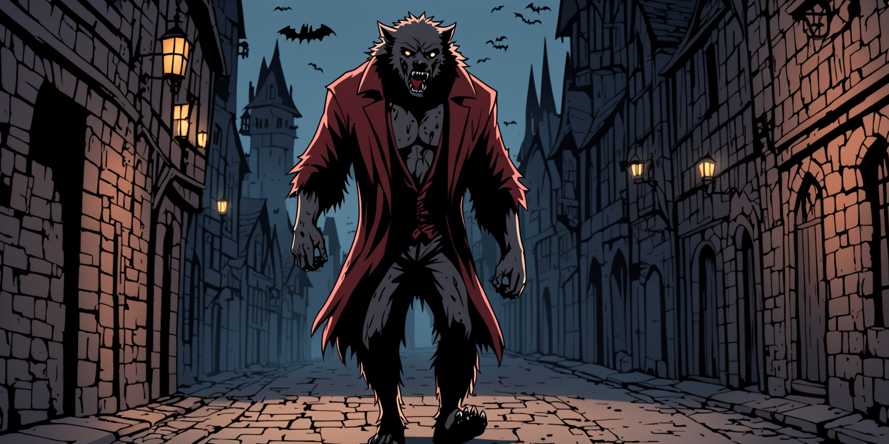

<audio controls>
  <source src="Audio/Sesja_6.mp3" type="audio/mpeg">
  Twoja przeglądarka nie obsługuje elementu audio.
</audio>

Po dotarciu do Wieży Arystokratów i wdrapaniu się na najwyższe piętro, oczom Blokusa i Wolfharta ukazała się wielka sala zapełniona zamaskowanymi biesiadnikami w szykownych strojach. Dagan od razu wytknął im fakt noszenia przez nich nieodpowiedniego ubioru i zalecił skierowanie się w kierunku szatni, gdzie Palladyn i Krasnolud wybrali sobie arystokratyczną odzież oraz skorzystali z usług golibrody. Po powrocie na salę Dagan stwierdził, że musi załatwić pewną sprawę i wyszedł z sali. Bohaterowie zauważyli, że choć wszyscy goście noszą maski, to niektórzy z nich mają je przyozdobione charakterystycznym kanciastym wzorem przypominającym drzewo błyskawic. Po powrocie Dagan przedstawił nowych przyjaciół swojemu bratu Wiktorowi i zaproponował partyjkę w kości. Początkowo naszym bohaterom szło nieźle, ale w ostatniej rundzie Dagan sprytnie podbił stawkę, a Wiktor dokończył dzieła wyrzucając królewskiego pokera, pozostawiając tym samym Blokusa i Wolfharta z paroma setkami w plecy.

W tym samym czasie Ariel i Baldwin postanowili rozejrzeć się po garnizonie oraz kupić wyposażenie przed wybraniem się na przeszpiegi do Wieży Arystokratów. Ariel sprzedała jednego z młodych toksycznego jaszczura, w skutek czego mogła wykupić się z długu finansowego względem Baldwina. Następnie znienacka pojawił się mag Merendir, pytając, czy bohaterowie dowiedzieli się czegoś na temat mistrza Nikoli oraz miejscowego czarodzieja, oraz zaoferował swoją pomoc w wyprawie na maskaradę, ale Baldwin stanowczo odrzucił jego pomoc. Bohaterowie ruszyli następnie po dachach w kierunku wieży, aby potem wspiąć się na jej czwarte piętro. Po wejściu do ciemnego korytarza stoczyli walkę z przyczajonym tam wąpierzem.

Po hazardowej porażce Blokus i Wolfhart postanowili odejść od stołu i wkręcić się w wir balu. Wolfhart użył paru swoich żartów, aby zrobić wrażenie na jednej z tańczących dam noszącej maskę w odmiennym wzorze, co udało mu się bez większych trudności, a raczej tak mu się przynajmniej wydawało... Blokus postanowił ruszyć niepostrzeżenie za Daganem, który znów oddalił się, tłumacząc się swoimi sprawami. Śledząc Dagana, Blokus zauważył, że rozmawia on z jakąś damą, wyróżniającą się burzowym wzorem na masce, po czym nagle rzucił się na nią, wbijając kły w jej szyję. Blokus zdecydował się zostawić ten fakt dla siebie i oddalił się, ale Dagan wychodząc zza rogu zapytał go, dokąd zmierza, po czym na oczach Palladyna zasztyletował dwóch strażników. Blokus nie zadając zbędnych pytań, spytał Dagana, co teraz planuje, młodzieniec natomiast poprosił go o pomoc w przekradnięciu się w pobliże mistrza ceremonii. Wolfhart po udanym tańcu i wymianie komplementami został zaproszony przez tajemniczą damę do loży VIP, gdzie też się z chęcią udał. Blokus użył swoich zdolności, aby zmienić jednego z trupów w ożywieńca, który posłużył im za przykrywkę. Podczas zakradnięcia się w pobliże mistrza ceremonii, Dagan spotkał swojego znajomego, który zaczepił go, zwracając tym samym uwagę straży. Dagan rzucił się od razu ze sztyletem w kierunku mistrza ceremonii, ale strażnicy byli szybsi i odcięli mu drogę. Zaczęła się panika. W tym samym czasie loża VIP szykowała się do rozpoczęcia uczty, ale burda wzbudziła ich podejrzenia, więc tajemniczy osobnicy wrócili na salę. Goście klasy VIP w burzowych maskach zaczęli atakować innych biesiadników, rzucając się im do gardeł. Po sali zaczęły latać nietoperze, co chwila zmieniające się w wampiry wysysające krew z kogo popadło. Wulfhart i Blokus zauważyli, jak Dagana od tyłu próbuje zaatakować strażnik z halabardą, ale postanowili się nie mieszać, w skutek czego młody wampir oberwał w plecy i zemdlał.

Ariel i Baldwin, po wdrapaniu się na balkon najwyższego piętra, znaleźli ciało kobiety w nietypowej masce. Następnie wpadli przez okno do sali balowej. Kiedy zobaczyli zaistniałą sytuację, podeszli do strażników, a Baldwin przedstawił się im jako wysłannik Vincenta Meisa, okazując srebrny kastet strażnika. Od tej pory wraz z Ariel mieli zapewnić mistrzowi ceremonii bezpieczeństwo, co też zrobili, uciekając z nim przez balkon na dachy.

Blokus i Wulfhart postanowili uciekać z sali za strażnikami wyprowadzającymi Dagana, ale zamiast pomóc wampirowi stwierdzili, że przeszukają lożę VIP. Znaleźli tam Wiktora, z którym ruszyli ratować Dagana. Dotarli do długiego korytarza w lochach na przedostatnim piętrze...

Po przesłuchaniu mistrza ceremonii w karczmie (Baldwin potraktował go srebrem, ale okazało się, że mistrz nie jest wampirem). Ariel i Baldwin zabrali go do kapitana straży. Podczas rozmowy Baldwin kazał Vincentowi Meisowi chwycić srebrny kastet. Kapitan zrobił to, ale odmówił pokazania dłoni i zagroził Baldwinowi wezwaniem straży. Jako odpowiedź krasnolud uderzył kapitana srebrnym kastetem oraz, używając siły perswazji, przekonał strażników, że ich dowódca jest wampirem. Bohaterowie postanowili wtrącić Meisa do miejskiego lochu, gdzie natknęli się na martwe ciało Wiktora, oraz Blokusa i Wolfharta walczących ze strażnikami sił specjalnych...

Za oknem ukazała się pełnia, w skutek czego kapitan Vincent Meis rozerwał kajdany i zmienił się w wilkołaka, ku wielkiemu zdziwieniu wszystkich obecnych. Baldwin rzucił się od razu wraz ze strażnikami sił specjalnych na potwora, a Ariel wpakowała mu srebrną strzałę w brzuch. Blokus i Wolfhart rzucili się do ucieczki wraz ze strażnikami miejskimi, ale Palladyn postanowił wrócić do walki, a krasnolud przeszukać zwłoki Wiktora i Dagana, po czym w przypływie altruizmu zdecydował się ocucić młodego wampira. Dagan po przebudzeniu od razu chciał zabić zabójcę brata, ale Wolfhard przekonał go, że wilkołak jest teraz większym problemem. Ostatecznie Dagan i Wolfhart zdecydowali się zabrać ciało Wiktora i uciec w bezpieczne miejsce. Reszta drużyny natomiast stoczyła epicką walkę z wilkołakiem, którą zakończyła Ariel wyrzucając potwora za pomocą ognistego pocisku przez okno.

Blokus zdecydował się powołać do życia kolejnego mrocznego sługę, a Baldwin i Ariel zeszli na dół szukać ciała wilkołaka, ale znaleźli jedynie ślady prowadzące do starej piwnicy na wino, gdzie znaleźli na wpół żywego Meisa w ludzkiej postaci. Baldwin chciał zabić kapitana, ale Ariel powstrzymała go, podstawiając mu nogę, w skutek czego wilkołak zdołał wyczołgać się z piwnicy i zniknąć w mroku nocy...

Wolfhart i Dagan zajechali powozem do wieży mistrza Nikoli, wynalazcy i geniusza, który okazał się być przybranym ojcem Dagana. Po stwierdzeniu zgonu bohaterowie pochowali Wiktora nieopodal laboratorium ojca. Wolfhart dowiedział się niesamowicie dużo na temat Dagana, mianowicie, że jest on hybrydą wampira z wilkołakiem, czyli dhampirem, istotą żywiącą się krwią wampirów oraz, że Vederoth skrywa o wiele więcej tajemnic niż tylko ruchome mury czy wieczny mrok...

#### Sesja 7

##### *"WIELE RZECZY DZIAŁO SIĘ WÓWCZAS W VEDEROTH, ALE O NICZYM TAK NIE PLOTKOWANO, JAK O RYCHŁYM UPADKU WAMPIRZYCH RZĄDÓW"*

###### *"Kronika pieśni" barda Oliviera z Dereth, rozdział IV*

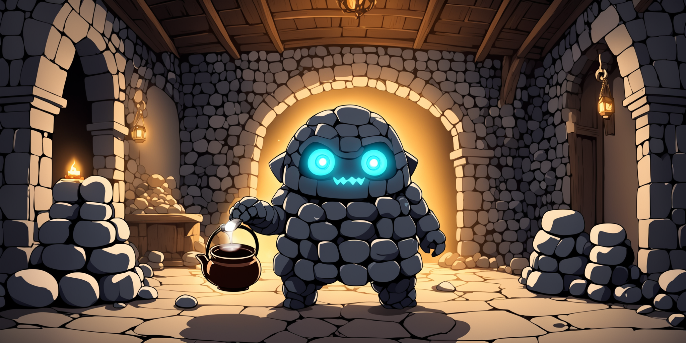

<audio controls>
  <source src="Audio/Sesja_7.mp3" type="audio/mpeg">
  Twoja przeglądarka nie obsługuje elementu audio.
</audio>

Po niefortunnym spotkaniu z wilkołakiem, nasi bohaterowie pozostali w rozdzieleniu. Baldwin był wściekły, że Ariel nie pozwoliła mu wykończyć potwora, ale ponieważ ta już się wykupiła, nie miał nic do gadania.

Wulfhart i Dagan postanowili udać się do wieży miejskiego czarodzieja, aby posunąć naprzód sprawę rozwiązania zagadki mroku spowijającego miasto. Gdy dotarli do wieży, stoczyli walkę z dwoma wampirami, które Dagan pod postacią nietoperza szybko wykończył. Wejście do kwatery maga było chronione przez iluzoryczną zaporę, którą jednak udało się bohaterom szybko sforsować. Za magicznymi drzwiami ich oczom ukazał się mroczny labirynt, który jednak nie dostarczył krasnoludowi i dhampirowi szczególnych wrażeń. Znaleźli oni bez problemu wejście do sali głównej mieszkania czarodzieja. Nie spotkali tam nikogo za wyjątkiem małego golema od herbaty siedzącego w kuble na śmieci, który niestety nie udzielił im zbyt wielu wyjaśnień. Nagle odkrywcy usłyszeli hałas otwieranego magicznego portalu i z ukrycia byli świadkami sceny rozmowy trzech mrocznie wyglądających czarodziejów. Niestety z ich rozmowy niewiele wynikało, a z racji odległości nawet wyczulony na dźwięki Dagan nie zrozumiał zbyt wiele.

W tym czasie Blokus, nie wykazując się ogładnym myśleniem, zamknął powołane przez siebie do życia zombie w szalecie nieopodal karczmy. W karczmie został zaczepiony przez Dredzika. Elfka zaproponowała mu "spacer" do pirackiego dyliżansu. Kapitan piratów akurat przechadzał się nieopodal i usłyszał odgłosy żekomego "spaceru" oraz zbulwersowany zapytał o co chodzi. Blokusowi jednak udało się go przekonać, że uprawia z jego córką zwykły hazard.

Gdy wszyscy bohaterowie wrócili do karczmy, postanowili za namową Ariel sprawdzić pokój czarodzieja Merendira, którego powoli zaczynali podejrzewać o konszachty z ciemnymi mocami. Za pomocą języka zwierząt Ariel wypytała miejscowego szczura, czy nie widział czegoś podejrzanego. Szczur opisał w miarę swoich możliwości straszne hałasy docierające niekiedy z pokoju.

Podczas przeszukiwania pokoju nagle otworzył się magiczny portal, z którego wyskoczyło trzech mrocznych magów. Po potężnym starciu bohaterowie przeżyli tylko z powodu brawurowej walki Dagana, gdyż magowie byli dla nich o wiele za potężni.

#### Sesja 7+

##### *"TO NIE OSZUSTWO, JEŚLI CIĘ NIE ZŁAPIĄ"*

###### *Darby Hazardzista*

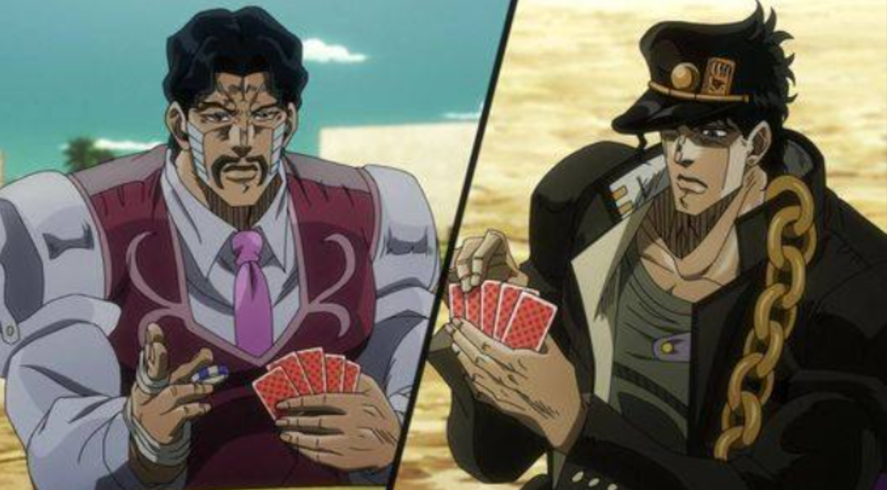

<audio controls>
  <source src="Audio/Sesja_7P.mp3" type="audio/mpeg">
  Twoja przeglądarka nie obsługuje elementu audio.
</audio>

Wulfhart i Baldwin spędzili miło czas, grając w pokera o własne dusze oraz dusze swoich towarzyszy z Darbim Hazardzistą. Początkowo prawie stawili czoła śmierci, lecz po paru rzutach i z małą pomocą Dagana udało im się nie tylko odzyskać rozczłonkowane fragmenty swoich dusz, ale także uratować z pułapki Blokusa i Ariel. Następnie pokonali również w turnieju łuczniczym Darbiego Łucznika zyskując tym samym nieco złota. Dusza Darbiego Hazardzisty została przez nich zawłaszczona i od tej pory pozyskali pokerzystę jako swojego niewolnika. Historia ta jednak nie kończy się w tym miejscu...

#### Sesja 8

##### *"ZA DNIA SZKARADĄ, W NOCY ZAŚ NIE WIDAĆ"*

###### *"Kronika pieśni" barda Oliviera z Dereth, tytuł rozdziału V*

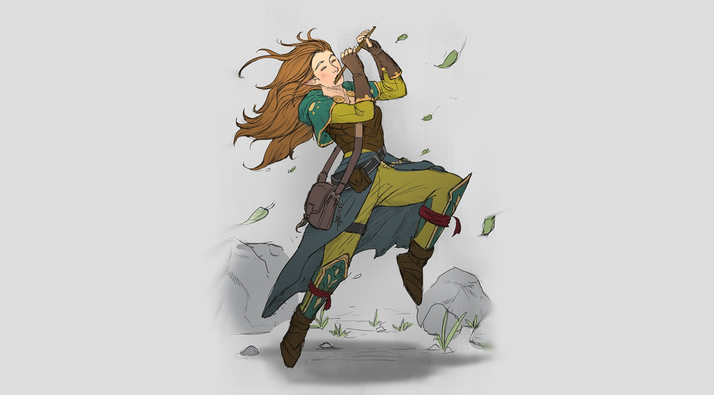

<audio controls>
  <source src="Audio/Sesja_8.mp3" type="audio/mpeg">
  Twoja przeglądarka nie obsługuje elementu audio.
</audio>

Gdy Wulfhart, Baldwin i Dagan schowali nowo nabyte żetony do kieszeni, od razu ruszyli na górę, żeby sprawdzić, czy dusze ich przyjaciół powróciły do ciał. Ariel siedziała na łóżku, wyspana jak nigdy, a Blokus natomiast zniknął. Zniknęła nie tylko jego dusza, ale i ciało. Drużyna postanowiła na razie olać sprawę i udać się na dół.

Tam spotkali małą, sympatyczną elfią bardkę, Laurindie, która zaproponowała, że wychyli z Ariel kielicha. Tak się złożyło, że w pobliżu siedział Dredzik, i na piękną elfią buzię wtrącił się do picia. Ariel i Dredzik sponiewierali się mocno, Laurindie natomiast dzięki sobie znanym sposobom pozostała trzeźwa. Opowiedziała pijanym elfkom o medalionie smoczych emocji, artefakcie mogącym wpływać na zachowanie smoków, który ukryty jest w podziemiach miasta. Dodała również, że jest w posiadaniu mapy, która pozwoli im tam dotrzeć. Niestety ona sama się boi iść, zatem szuka ekipy poszukiwawczej. Jej opowieści przysłuchiwał się potajemnie Baldwin, zaznaczył że jej propozycja jest nieco podejrzana, ale pijane elfki stwierdziły, że wchodzą w tą przygodę na 100%.

Wulfhart i Baldwin, widząc, że ich nie powstrzymają, oraz mimo swojego rozsądku również ostrząc sobie zęby na tajemniczy artefakt, zgodzili się dołączyć do eksploracji podziemi. Kapitan piratów powierzył Wulfhartowi, jako zaufanemu członkowi swojej załogi, opiekę nad Dredzikiem.

Na starym cmentarzu Laurindie otworzyła podziemne przejście. Po przedarciu się przez szereg korytarzy bohaterowie znaleźli parę rzeczy, które sprawiały wrażenie, że lochy są zamieszkane przez kogoś cywilizowanego. Gdy dotarli do zaznaczonej na mapie sali z wyrytymi napisami w pradawnym języku, zastanowili się, jak uruchomić przejście prowadzące dalej. W ścianie, w odległości co 3 metry, znajdowały się 4 pary dźwigni, prawdopodobnie obsługujących bramę. Bohaterowie włożyli ręce w otwory z dźwigniami, dając się złapać w mechaniczną pułapkę, skuwającą ich wszystkich w kajdany. Na wolności pozostał jedynie Jaszczur Wulfharta, lecz zamiast się na coś przydać, skomląc schował się pod ścianą i warczał w kierunku korytarza.

Jak się okazało, powodem jego przerażenia był drakon, który wszedłszy do komnaty, powitał Laurindie z wyrazami miłości i uwolnił ją z pułapki. Rozpromieniona elfka szybko rzuciła mu się na szyję i z sadystycznym spojrzeniem pobiegła do swojej komnaty po narzędzia mordu. Zaczęła od Dredzika, któremu podcięła żyły na nadgarstku. Okazało się, że drakon jest zaklętym elfem, który z powodu zrabowania wielu rzeczy ze skarbca podziemi został obarczony klątwą. Do rytuału przemiany potrzebna mu jest krew elfa, człowieka i krasnoluda.

Wulfhart użył swojej papugi, aby wydostać się z okowów, i uwolnił Ariel. Wspólnie pokonali Laurindie i drakona, żądając następnie zaprowadzenia ich do jaskini skarbów. Laurindie ostrzegła ich jednak, że jeśli wezmą więcej niż 1 artefakt na głowę, zostaną przeklęci jak jej ukochany. Bohaterowie usłuchali przestrogi i wybrali sobie po jednym magicznym artefakcie.

Ariel natomiast zdecydowała, że do zrealizowania swoich celów postać drakona jest zdecydowanie bardziej odpowiednia, toteż zaopatrzyła się w parę artefaktów, ściągając na siebie klątwę.

#### Sesja 9

##### *"KOŚCI ZOSTAŁY RZUCONE"*

###### *Łacińskie przysłowie*

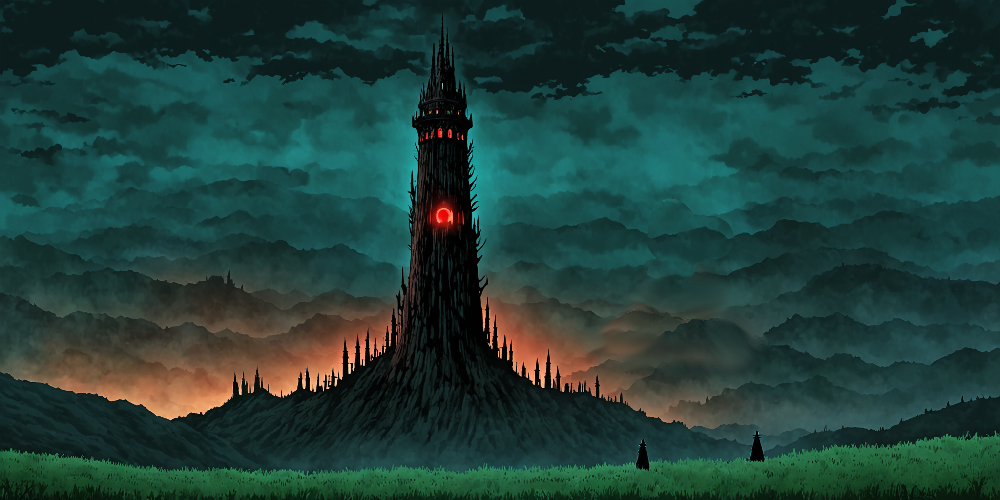

<audio controls>
  <source src="Audio/Sesja_9.mp3" type="audio/mpeg">
  Twoja przeglądarka nie obsługuje elementu audio.
</audio>

Po niebezpiecznej przygodzie w podziemiach cmentarzyska w Vederoth, nasi bohaterowie wyruszyli z miasta wraz z załogą piratów.

Podczas podróży zostali poproszeni o zorganizowanie jakiegoś prowiantu z pobliskiego lasu. Baldwin, jak to miał zwykle w zwyczaju, wyruszył skradając się między drzewami, a elfka, to znaczy teraz drakonka Ariel i krasnolud Wulfhart wyruszyli tropić zwierzynę, polegając na swoich talentach łowcy.

Gdy para łowców namierzyła wspaniałe stado saren i towarzyszącego im w żerowaniu tłustego dzika, wydawało się, że kolacja szykuje się przednia. Niestety Baldwin zgubił w lesie drogę i nic nie znalazłszy zaczął wołać głośno towarzyszy, płosząc tym samym zwierzynę. Ostatecznie naszej trójce udało się upolować jedynie dzika. Gdy wrócili do obozu po 3 godzinach, okazało się, że uczta trwa już w najlepsze, gdyż Dagan natknął się podczas poszukiwań swojego posiłku na spłoszone stado saren.

Po tygodniu monotonnej drogi karawana dotarła wreszcie do granicy Smoczych Wzgórz. Drużyna była podzielona odnośnie tego, czy wyruszyć skrótem przez Smocze Wzgórza do Valinoru, ryzykując niebezpieczne spotkanie ze smokami, czy też nadłożyć 3 dni drogi zmierzając okrężną trasą. Bosman wyraził stanowczy sprzeciw odnośnie skracania trasy, ale Baldwin wyjaśnił go wygrywając z nim walkę na pięści. Ostatecznie decyzja została podjęta, bohaterowie przeprawią się przez smoczą krainę.

Jadąc od paru dobrych godzin, konwój nie natrafił na żadnego smoka, ku wielkiej radości kapitana Arrowa. Na horyzoncie, za wzgórzem, dało się jednak dojrzeć trupiobladą poświatę. Po pokonaniu wzgórza, oczom bohaterów ukazał się ogromny, zakopany do połowy w ziemi szkielet smoka oraz strzelista wieża z trupiobladym trzpieniem zakończonym oszlifowanym kryształem. Był to nekromatron, urządzenie służące do wskrzeszania wiecznego cmentarzyska podobnego do tego, które otaczało niegdyś Vederoth. Trójka naszych bohaterów wraz z Daganem postanowili przyjrzeć się bliżej budowli. Okazało się, że jest ona otoczona garnizonem szkieletów, zjaw i ożywieńców. Załoga wszczęła walkę z nieumarłymi, która zakończyła się zwycięstwem, głównie za sprawą noszonego przez Wulfharta antynieumarłego Hełmu Blasku, artefaktu z drakońskiej pieczary z cmentarzyska w Vederoth...

#### Sesja 10

##### *"GDZIE JEST MÓJ GARNIZON NIEUMARŁYCH DO KY NĘDZY!?"*

###### *Relodora Tlintaryd, generał drowiej armii*

<audio controls>
  <source src="Audio/Sesja_10.mp3" type="audio/mpeg">
  Twoja przeglądarka nie obsługuje elementu audio.
</audio>

Zwycięstwo! Nasi bohaterowie odnieśli triumf! Słychać radosne krzyki piratów, dźwięki łamanych szkieletowych kości i... kroki 30 000 armii drowów zmierzającej w naszym kierunku.

Nasza drużyna nie mogła się długo zdecydować, co robić, zatem Dagan i kapitan Arrow podjęli decyzję, że jak chcą, to niech zostają, ale oni zawracają, nie chcąc wchodzić w szranki z potężną armią mrocznych mieszkańców Underdarku.

Armia drowów stanęła pod wieżą, ale nasi bohaterowie zdążyli już się ukryć. Baldwin wspiął się dla lepszej obserwacji na nekromatron, Ariel schowała się w smoczej czaszce, a Wulfhart zaczął uciekać za wzgórze. Nie wyszło mu to jednak najlepiej, gdyż szybko dogoniło go dwóch drowich jeźdźców, z którymi stoczył walkę, zaklinając swój łuk magicznymi płomieniami z hełmu blasku. Udało mu się uciec, kradnąc konia jednemu z mrocznych elfów, i uciekając do załogi piratów. Ariel również nie dała się pochwycić, uciekając dwóm strażnikom oraz ich paskudnym ogarom myśliwskim. Drowy musiały zrezygnować z dalszego pościgu, ponieważ słońce miało się pojawić na horyzoncie za 2 godziny. Jedynie jeden zamaskowany typ, jak się okazało później stażysta-nekromanta, został, aby wskrzesić ponownie armię nieumarłych do budowy mrocznej wieży. Nie wyszło mu to jednak za dobrze, gdyż powołał ze szczątków 10 ożywieńców i 10 szkieletów. Baldwin przycelował i zastrzelił stażystę kuszą ręczną, a następnie rozprawił się podobnie z paroma nieumarłymi.

Drużyna postanowiła, że niezwłocznie należy zniszczyć nekromatron, ale okazało się, że bez większej ilości prochu strzelniczego może to być trudne. Kapitan Arrow zaproponował zatem, aby odbili w kierunku portu Valinorskiego, gdzie siedzibę miała reszta załogi piratów pod dowództwem kapitana Johna Arrowa, brata już nam znanego kapitana.

Po dotarciu do Valinoru piraci skakali ze szczęścia, że udało im się w końcu spotkać swoich towarzyszy. Dredzik rzucił się w ramiona swojej kuzynki, niejakiego Loczka. Ariel poczuła z tego powodu wielki smutek, gdyż jej rodzina zginęła podczas wojny ze smokami. Postanowiła zatem odwiedzić zgliszcza swojego domu rodzinnego, ku jej zdziwieniu zamieszkanego przez jej daleką ciotkę, która z początku wystraszyła się jej drakońskiej postaci, ale jej mąż wziął sprawę na chłodno i uwierzył w historię Ariel. Niestety drakonka dowiedziała się, że jej rodzina całym sercem trzyma z drowami, uważając ich za wybawców z rąk smoczych oprawców, a tym samym nie chcąc zauważyć niebezpieczeństwa ze strony armii ciemności. Jej elfie serce powoli zaczynało gasnąć, napełniając się coraz większym dystansem do swojej rasy.

Oprócz tego bohaterowie udali się również na zakupy. Baldwin zakupił parę sztuk elitarnego oręża, Wulfhart i Ariel zaopatrzyli się w sklepie zoologicznym w mini-taura, kamiennego gargulca oraz niewychowaną magiczną papugę o imieniu Krug.

#### Sesja 11

##### *"NIE WIEM CO ZA SZALENIEC WYMYŚLIŁ BAJKĘ O MAŁEJ SYRENCE"*

###### *Dwaren, krasnoludzki menel z Valinoru*

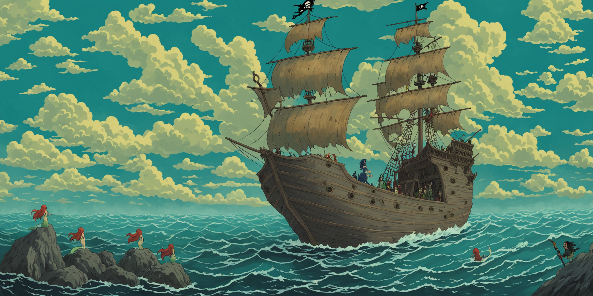

<audio controls>
  <source src="Audio/Sesja_11.mp3" type="audio/mpeg">
  Twoja przeglądarka nie obsługuje elementu audio.
</audio>

Po udanych zakupach, nasi bohaterowie wrócili do siedziby piratów, gdzie zastali, bez większego zdziwienia, zakrapianą biesiadę. Kapitan wraz ze swoim bratem dyskutowali na temat przejęcia pirackiej wyspy przez smoki i planu odzyskania należących im się ziem. W rozmowie tej czynny udział brał oczywiście Wulfhart, który awansował na asystenta bosmana.

Dredzik zniesmaczony zachowaniem Loczka, obściskującego się z Daganem na tyłach knajpy, zaproponował Ariel kielicha, co skończyłoby się jak zwykle, gdyby nie to, że umysł Ariel znosił alkohol nadwyraz dobrze. Dredzikowi natomiast urwał się film.

Wulfhart miał już nadwyraz dość elfiego jadła, dlatego zaproponował Ariel i Baldwinowi, aby poszukali jakiejś krasnoludzkiej jadłodajni. Trafili na jedyną w mieście krasnoludzką knajpę, w której to urocza diabelstwia kelnerka podała im komplet krasnoludzkich przysmaków na ostrym sosie. Znienacka do knajpy wszedł nieznajomy półelf, z którym to Baldwin wdał się w bójkę, która z pewnością skończyłaby się dla półelfa śmiercią, gdyby nie akt miłosierdzia ze strony Baldwina i groźby krasnoludzkiego właściciela restauracji.

Gdy bohaterowie przeszukiwali pobitego półelfa, przemknął pomiędzy nimi osobnik w czarnym kapturze. Baldwin od razu domyślił się, kim ów jegomość mógł być, i ruszył za nim ukradkiem. Wulfhart i Ariel natomiast dopiero po paru minutach zauważyli, że zostali okradzeni z cennych artefaktów.

Baldwin dogonił obcego złodzieja i siłą odebrał mu hełm blasku, co poskutkowało dla niego zamianą w drakona, podobnie jak Ariel.

W tym samym czasie Wulfhart i Ariel wrócili do piratów i wyruszyli z kapitanami na tajną misję "pożyczenia" z przystani niepilnowanego okrętu. Okazało się, że ów okręt nie dość, że był niepilnowany, to jeszcze należał do Valinorskiej gildii złodziei, a spotkany uprzednio przez Baldwina jegomość był jej członkiem. Ich to właśnie obezwładnili na statku, zmuszając do wypłynięcia z nimi na pełne morze, uprzednio sprowadzając całą załogę piratów i krasnoludzkiego menela, którego Baldwin postanowił wykorzystać do krwiożerczego rytuału przemiany.

Na morzu nasi bohaterowie stoczyli epicki bój z syrenami oraz Daganem, który dał się oczarować ich magicznemu śpiewowi. Wulfhart wyczuł pod powierzchnią wód obecność jakiejś istoty, z którą postanowił nawiązać kontakt. Wykonał perfekcyjne zaklęcie obezwładniające, które jednak okazało się być niczym dla przedwiecznego krakena, pana głębin. Zniesmaczony Wulfhart nie do końca zdawał sobie sprawę z tego, co właśnie wybudził ze snu, i jakie miał szczęście, że głowę krakena również zaprzątnęła taka sama wątpliwość.

Po walce z syrenami, naszych bohaterów zaskoczył sztorm, który wyrzucił ich na brzeg wyspy, nazywanej przez piratów "wyspą skazańców", ponieważ to na niej zwykle porzucało się tych, których już nie chciało się w tym życiu zobaczyć...

#### Sesja 12

##### *"HAKIDI RAKATA"*

###### *Tubylec z wyspy skazańców*

<audio controls>
  <source src="Audio/Sesja_12.mp3" type="audio/mpeg">
  Twoja przeglądarka nie obsługuje elementu audio.
</audio>

Na wyspie skazańców, bohaterowie zaczęli zastanawiać się, jak naprawić rozbity statek. W tym celu udali się w głąb dżungli. Po zauważeniu smakowicie wyglądającej pieczonej świni, postanowili ją zabrać, w skutek czego wpadli w pułapkę miejscowych kanibali. Udało im się jednak po krótkim starciu wyswobodzić, po czym zmusili jednego z tubylców do zaprowadzenia ich do osady pierwotnych istot.

Po przeszukaniu osady okazało się, że tubylcy są pod kontrolą Laurindie i jej zaklętego w drakona ukochanego. Ukochany Laurindie, z pomocą tubylców pod dowódctwem Blokusa Maximusa, podstępem pochwycił część załogi piratów i chciał ich złożyć w ofierze bogom wulkanu, ku uciesze szamana tubylców.

Kiedy jednak Blokus zauważył, że na odsiecz ofiarom pędzą członkowie jego starej ekipy, postanowił zmienić stronę. Szamana wrzucił do wulkanu, a uciekającego drakoniego-elfa-kochanka Laurindie dopadli razem z Ariel, Wulfhartem i Baldwinem.

Uciekając, ukochany Laurindie porzucił ją na pewną śmierć, przez co znienawidziła go dogłębnie i nie płakała po jego śmierci, chcąc od teraz stanowić część drużyny bohaterów na wyprawie na wyspę smoków. Po naprawieniu statku z pomocą tubylców, bohaterowie wyruszyli w kolejny rejs, tym razem ostrożniejszy, w kierunku wyspy smoków. Podczas rejsu jednak Laurindie tajemniczo zniknęła wraz z Blokusem...

#### Sesja 13

##### *"STRZELAĆ BEZ ROZKAZU!"*

###### *Trzeci już kapitan piratów w tej historii*

<audio controls>
  <source src="Audio/Sesja_13.mp3" type="audio/mpeg">
  Twoja przeglądarka nie obsługuje elementu audio.
</audio>

Na otwartym morzu, naszych bohaterów obudził jazgot spowodowany przez Baldwina, który usiłując oddać płyny, wypadł za burtę wprost na czyszczącego kadłub Loczka.

Po paru przekomarzaniach pomiędzy pasażerami, załoga piratów spostrzegła na horyzoncie tajemniczą banderę. Gdy zaczęli płynąć w jej stronę, celem zrabowania do ostatniej monetki, okazało się, że w ich stronę również płyną piraci...

Rozpoczęła się bitwa morska, podczas której działo się niesamowicie dużo osobliwości. Okazało się, że w skład wrogiej załogi wchodzi cały szwadron... latających chłopców.

Bitwa skończyła się zdewastowaniem obu statków, złamaną kostką Dagana, śmiercią prawej ręki wrogiego kapitana oraz zwycięstwem naszych bohaterów. Po przejęciu okrętu wrogich piratów wyjaśnili oni, że na wyspie smoków zagraża im złoczyńca porywający małych chłopców i wyrządzający im straszne krzywdy.

Po nocy spędzonej w obozowisku latających piratów, bohaterowie postanowili ruszyć w kierunku smoczego miasta, nazywanego tam "Smoczą Utopią".

Podczas podróży załoga musiała się na chwilę zatrzymać, aby upolować nieco prowiantu. Wulfhart i Baldwin wrócili z wielkim dorodnym dzikiem na plecach, którego wynegocjowali od napotkanej wróżki. Ariel natomiast przyprowadziła ze sobą tajemniczego młodego chłopca, przywódcę leśnego oddziału latających chłopców, o imieniu Piotruś.

#### Sesja 14

##### *"AAAAAAAAAA .... AAAAAAAAAAAAAAAAA"*

###### *Podopieczni Piotrusia*

<audio controls>
  <source src="Audio/Sesja_14.mp3" type="audio/mpeg">
  Twoja przeglądarka nie obsługuje elementu audio.
</audio>

Podczas rozmowy drużyny z Piotrusiem wyszło, że ten coś ukrywa, a przynajmniej tak wyczuł to Baldwin, w skutek czego zaatakował tajemniczego przybysza. Atak nie wyszedł najlepiej, aczkolwiek Wulfhart użył swojego gargulca do pojmania Piotrusia.

Drużyna kazała więźniowi zaprowadzić się do obozowiska, gdzie przetrzymywał on małych chłopców, którzy, jak się okazało, byli do niego przywiązani niczym do wodza, aczkolwiek totalnie nieświadomi, że ich poprzedni koledzy, którzy znikają co jakiś czas, nie idą do "lepszego miejsca". Po wyciągnięciu od Piotrusia szczątkowych informacji Baldwin zabija go i ku przerażeniu grupy dzieci wiesza na gałęzi.

Drużyna po przeszukaniu Piotrusiowego domku na drzewie udaje się w głąb lasu, gdzie spostrzega po jakimś czasie na zielonej polanie ogromnego zielonego smoka śpiącego, aczkolwiek i tak wyglądającego groźnie. Decydują się ominąć go szerokim łukiem i tak docierają na rozdroże z dwoma odnogami prowadzącymi do Smoczej Utopii oraz Świątyni Avandry i Corellona.

Bohaterowie decydują się z początku udać się na modły przed dalszym wyruszeniem w drogę ku przygodzie. Wizyta w świątyni okazuje się być zaskakująco pozytywnym przeżyciem. Kapłani świątyni, [Dravanna i Rellocon](Dravanna_i_Rellocon.html) pomagają drużynie powrócić z postaci drakonów do swoich pierwotnych ras, zdejmując klątwę artefaktów. Część artefaktów zostaje jednak złożona bogom w ofierze, za co bogowie poprzysięgli Baldwinowi i Ariel że nie stracą życia w murach Smoczej Utopii.

Po wizycie w świątyni ponadto kapłani proponują drużynie wzajemną pomoc i obiecują stawić się na wezwanie, gdy tylko drużyna potrze otrzymane od nich pierścienie. W zamian za to drużyna ma im pomóc również w razie niebezpieczeństwa.

Tak to bohaterowie ruszają kolejną odnogą, tym razem w stronę Smoczego Miasta...

#### Sesja 14+

##### *"..."*

###### *Cisza*

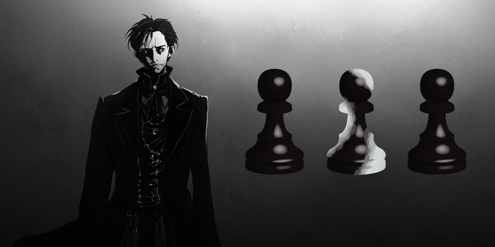

<audio controls>
  <source src="Audio/Sesja_14P.mp3" type="audio/mpeg">
  Twoja przeglądarka nie obsługuje elementu audio.
</audio>

Sen Wulfharta i Ariel w którym natknęli się na ponurego przewodnika po koszmarze. Oboje obudzili się w karczmie w Vederoth w tym samym czasie,  w którym toczyła się gra o duszę Ariel, która przegrała uprzednio z Darbim Hazardzistą. Tajemniczy ponury jegomość przeprowadził bohaterów przez mroczne pokoje w których musieli oprzeć się błaganiom topiącej się w beczce dziewczynki, zaszlachtować niewinnego małego kucyka oraz ostatecznie dojść do pokoju w którym znajdowała się szachownica z trzema pionkami i jednym królem z tyłu. Wszystkie figury były czarne, a jedynie jeden pionek był nieudolnie przemalowany z czarnego na biały. Za bohaterami znajdowało się troje drzwi w analogicznym zabarwieniu do pionków. Po przyjrzeniu się scenerii pokoju bohaterowie zauważyli że mroczny jegomość wyjął za ich plecami narzędzie mordu po czym powiedział "Uciekajcie stąd inaczej was zabiję". Ariel i Wulfhart przebiegli szybko przez biało-czarne drzwi po czym się obudzili...

#### Sesja 15

##### *"STARY SMOK MOCNO ŚPI"*

###### *Krasnoludzka kołysanka*

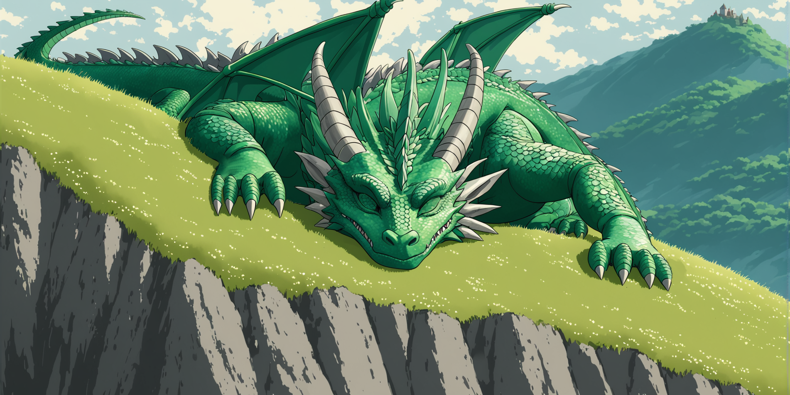

<audio controls>
  <source src="Audio/Sesja_15.mp3" type="audio/mpeg">
  Twoja przeglądarka nie obsługuje elementu audio.
</audio>

Po dotarciu w pobliże Smoczego Miasta oczom bohaterów ukazała się magiczna mroczna mgła. Jedynie Baldwin był w stanie ją przeszyć wzrokiem, ze względu na podpisanie paktu i zostanie Czarownikiem. Drużyna, omijając mgłę dzięki zaklęciu "Przejścia bez śladu" rzuconemu przez Ariel, przedarła się przez wyrwę w murze i dotarła na centralny plac smoczej twierdzy.

Uwagę bohaterów przykuła wysoka wieża strzeżona przez cały pluton szkieletów. To jednak nie powstrzymało śmiałków przed przejściem do środka. Omijając szkielety i nie zwracając na siebie uwagi, prześlizgnęli się do środka wieży.

W środku ich oczom ukazały się zrujnowane schody oraz troje drzwi, każde na innym piętrze wieży. Po wejściu do pierwszych drzwi oczom bohaterów ukazały się zatęchłe lochy, w których leżały jedynie kości przetrzymywanych niegdyś więźniów. Cele były puste, aczkolwiek rychło w czas bohaterom udało się wyczuć czyhającą na ich krew i mięso zjawę.

Wulfhart, mając w pamięci spotkanie z tajemniczym jegomościem z mrocznego snu, zaciął się i narysował czerwone jabłko swoją własną krwią na ścianie, ale nic konkretnego się nie stało... za to drużyna zaczęła na niego patrzeć nieco podejżliwie.

Za kolejnymi drzwiami znajdowały się schody prowadzące na mury. Po dotarciu na górę drużyna zauważyła parę szkieletów, z którymi dosyć sprawnie sobie poradzili. Niestety, dwa szkielety uciekły przyprowadzając bardziej wymagającego przeciwnika, jakim okazały się szkielety minotaurów. Z nimi drużyna poradziła sobie z nieco większym trudem, ale jednakowoż bez szwanku. Przy minotaurach znajdowały się naszyjniki umożliwiające widzenie przez mroczną mgłę.

Na końcu korytarza na murach znajdowała się zbrojownia. Poza cennymi egzemplarzami oręża znajdowała się tam również magiczna waza, w której, jak się okazało, siedział Dżin. Obiecał on spełnić jedno życzenie drużyny, aczkolwiek zaznaczył, że im poważniejsze będzie życzenie, tym większą cenę przyjdzie za nie zapłacić w przyszłości. Drużyna wybrała otworzenie magicznej kłódki do szafy znajdującej się w tej samej zbrojowni. W środku szafy znajdowała się magiczna księga, którą Baldwin począł intensywnie studiować. Dżin obiecał drużynie, że spełni ich jedno życzenie, jeśli tylko wydostaną go ze smoczego miasta i uwolnią.

Ostatnie drzwi były inne od poprzednich. Wykonane ze stali i przyozdobione złotymi runami emanowały magiczną aurą. Baldwin postanowił dotknąć ich powierzchni celem otwarcia, ale drzwi wyrwały mu palec. Namówił Ariel, aby ona spróbowała... w skutek czego elfka połamała sobie rękę. W tym samym momencie na dole dało się słyszeć próby otwarcia uprzednio zaryglowanego wejścia do wieży. Szkielety poinformowane przez swojego pobratymca, który skoczył przez okno zbrojowni, próbowały dostać się do środka. Wydawało się, że bohaterowie są w pułapce, gdy wtem magiczne drzwi nagle uciszyły swoją magiczną aurę i poczęły się otwierać. Stał za nimi... nekromanta Merendir. Przerażona drużyna od razu rzuciła się do walki, a Ariel natychmiastowo potarła pierścień od kapłanów. Nekromanta jednak nie wyglądał jakby interesowała go drużyna. Zaśmiał się tylko na próby ataku ze strony Baldwina, oddzielając go od siebie grubą ścianą lodu i wylatując przez dziurę w dachu, którą poczynił falą uderzeniową. Okazało się, że ruszył do walki z nadcierającymi już smoczymi wojownikami, z Prastarym Zielonym Smokiem na czele. Dzięki magii użytej przez Ariel udało się powstrzymać szkielety, które już przebiły się przez drzwi.

Dravanna i Rellocon, kapłani ze świątyni właśnie dotarli na miejsce i przekazali bohaterom swój plan złożenia modłów do ich bóstw, aby rozproszyć magiczną mgłę ułatwiającą smokom walkę. Udało się.

Do bohaterów podleciał pradawny Biały Smok i kazał im szybko wsiąść na swój grzbiet. Po epickim starciu między latającym miotającym magicznymi pociskami nekromantą, smokami oraz naszymi bohaterami, udało się poskromić mrocznego czarodzieja z Dereth... niestety kapłani spadli ze smoka w trakcie walki i prawdopodobnie roztrzaskali się o ziemię.

#### Sesja 16

##### *"BOGOWIE SĄ Z NAMI"*

###### *Każdy dowódca niezależnie od strony konfliktu*

<audio controls>
  <source src="Audio/Sesja_16.mp3" type="audio/mpeg">
  Twoja przeglądarka nie obsługuje elementu audio.
</audio>

Po pokonaniu nekromanty Merendira, pradawne smoki poprosiły naszych bohaterów o opuszczenie Smoczej Utopii, gdyż chciały zająć się jej odbudową oraz wprowadzić na najbliższe 300 lat regułę zakazu wstępu jakichkolwiek obcych. Jednak zanim bohaterowie opuścili smoczą twierdzę, zobowiązali się jeszcze do oczyszczenia korytarzy z wszelkich szkielecich niedobitków. W trakcie tejże inspekcji natknęli się na uwięzioną w lochu młodą drakonią zaklinaczkę o imieniu Nemmonis Akra.

Następnie, zapewne bohaterowie opuścili by już mury miasta, gdyby nie to, że Baldwin uparł się, aby przeszukać kolejny pokój zabezpieczony... kolejnymi złotymi magicznymi drzwiami. Wulfhart natomiast postanowił zejść na dziedziniec wraz z Ariel, aby przeszukać pole bitwy. Odnalazł ciało nekromanty Merendira, co okazało się kluczowe, ponieważ czarnoksiężnik posiadał przy sobie fiolkę wszkrzeszenia, która przywróciła by go do życia po 3 dniach, gdyby tylko Wulfhart nie przywłaszczył jej dla siebie.

Z pomocą czaru zmniejszenia Nemmonis Akry Baldwinowi udało się przeskoczyć i wejść poprzez małe okienko do środka zabezpieczonego pokoju. Znalazł tam niewiele przydatnych rzeczy, zrabował zatem co się dało, w tym podejrzane czarne płaszcze nekromantów. Nie myśląc za wiele zarzucił jeden na siebie i teleportował się za pomocą magii czarownika pod mury. W ramach dowcipu postanowił zgromadzonym już na górze towarzyszom spłatać figla, toteż zaczął udawać nekromantę... nie wiedząc o pobocznym efekcie swojego płaszcza, jakim było upodobnienie go do zionącej śmiercią nekromanckiej postaci.

Nie zastanawiając się wiele, drużyna rozpoczęła atak. Baldwin nawet teleportował się do nich na górę, przekonując ich po zdjęciu płaszcza, że to przecież on i tylko żartował, drużyna jednak po ostatniej akcji, kiedy to nekromanta przejął nad nim kontrolę, nie dawała za wygraną. Kiedy to drużyna miała już zadać Baldwinowi śmiertelne obrażenia, nagle znikąd pojawili się Dravanna i Rellocon i powstrzymali towarzyszy przed zadaniem ciosu.

Okazało się, że są oni nie kim innym, jak wcieleniem samych bogów, Avandry i Corellona. Zganili oni Baldwina za tak lekkomyślne korzystanie z ich przysięgi i dla kształtowania pokory zmienili go w gekona, dopóki nie poświęci się bezinteresownie dla swoich towarzyszy.

#### Sesja 17

##### *"BARBARZYŃCY, DRANIE I OKRUTNICY!"*

###### *Żebrak spod krasnoludzkiej karczmy*

<audio controls>
  <source src="Audio/Sesja_17.mp3" type="audio/mpeg">
  Twoja przeglądarka nie obsługuje elementu audio.
</audio>

Na plaży w północnej części Smoczej Wyspy nasi bohaterowie uwolnili magiczną papugę Wulfharta, aby sprowadziła statek na to miejsce. Bosman Dredzik z dumą opowiedział towarzyszom o tym ile to łupu udało im się zdobyć podczas plądrowania napotkanych statków i małych wysepek. Łup jednak należało spieniężyć, toteż Dredzik zarządził rejs w kierunku portowego miasta Dath na północy Valinoru. Dla odmiany do poprzednich rejs upłynął spokojnie i już niebawem oczom załogi ukazał się malowniczy port w Dath. Dredzik przekazał bohaterom po krótce najważniejsze informacje o mieście takie jak to, że działa tu jedna z najpotężniejszych gildii złodziei w Valinorze, oraz że używanie magii bez zezwolenia jest tutaj surowo zabronione.

Po przybiciu do brzegu bohaterowie postanowili zacząć zwiedzanie od zaopatrzenia się w nową broń oraz uzupełnienie zapasów. Natknęli się na tablicę zleceń na której znaleźli informację o niejakim Ser Rolandzie, który poszukuje wojów na krucjatę przeciwko złej wiedźmie z lasu. Przyjaciele wzięli Ariel i Nemmonis Akra udały się do miejscowego ciuchlandu w celu zaopatrzenia się w odzież. Znalazły tam skrawek tajemniczo wyglądającej mapy, oprawionej w ramkę. Nemmonis przypadkowo zbiła ramkę co spowodowało złość właściciela, który nalegał nachalnie, aby teraz kupiły zniszczony przedmiot.

Nemmonis zgodziła się i po zakończeniu dalszych zakupów obie bohaterki wyszły ze sklepu wyposażone w ów skrawek mapy, pierścień iluzji zmiennokształtnego, oraz suknię kamuflującą. Przy wyjściu spotkały Dagana, który poinformował je, że znalazł sklep z bronią ulicę dalej. Dagan użył swoich dampirzych zdolności aby przekonać sprzedawcę do sprzedarzy broni po zaniżonej cenie. 

W tym samym czasie Wulfhart z Baldwinem na ramieniu udali się do krasnoludzkiej tawerny w północnej dzielnicy miasta. Przed wejściem spotkali żebraka od którego chcieli zasięgnąć informacji o miejscowej gildii złodziei, aczkolwiek od nie wiedział zbyt wiele oraz skierował w ich stronę parę brzydkich epitetów, toteż Wulfhart pobił go na kwaśne jabłko.

Po wejściu do tawerny Wulfhart i Baldwin przysiedli się do dwóch krasnoludów rozmawiających o walkach na pięści. Po krótkiej wymianie zdań Wulfhart zgodził się wystartować w zawodach polegających na obijaniu sobie nawzajem mord. Nagroda była kusząca, bo wynosiła ponad 300 złotych monet. Baldwin natomiast miał plan. Spytacie jaki? Sprytny. Planował rzucać na przeciwników Wulfharta zaklęcia celem zwiększenia szans krasnoluda na zwycięstwo. Wulfhart stanął jak wryty kiedy zobaczył swojego przeciwnika, tak zwanego "Króla Tajemnic", który był diabelskim barbarzyńcą o muskulaturze, której nawet Blokus by się nie powstydził.

Wulfhart przegrywał, cios za ciosem "Król Tajemnic" spuszczał mu coraz mocniejsze manto. Jednak kiedy Wulfhart był już mocno osłabiony przeciwnik nachylił się do niego i zaproponował, że podda mu się, a wygraną uzyskaną z tej ustawki podzielą się po równo. Krasnolud przystał na propozycję i odpłacił "Królowi Tajemnic" paroma mocnymi uderzeniami, które powaliły go na ziemię ku zaskoczeniu publiczności. Po walce krasnoludy zaprosiły Wulfharta do pokoju na zapleczu aby się rozliczyć. Siedział tam sam pokonany "Król Tajemnic" oraz bawiący się krótkim sztyletem bard, który powitał ich z drwiącym uśmiechem na ustach, po czym zaproponował im aby wzięli 40 złotych monet i wynosili się z gospody jeśli nie chcą problemów. Bohaterowie wpadli w złość, aczkolwiek widzieli że nie mają szans w starciu z zapaśnikiem, bardem oraz dwoma krasnoludami więc wzieli pieniądze i wyszli. Wulfhart od tego momentu myślał o tym jak tu dopaść tego parszywego barda i dać mu nauczkę.

Wszyscy bohaterowie, to znaczy Ariel, Nemmonis Akra, Baldwin, Wulfhart oraz Dagan spotkali się pod drzwiami sklepu z magicznymi akcesoriami. Drużyna nie znalazła tam jednak nic interesującego, ponieważ akcyza na magię w efekcie powodowała mocne ograniczenie w ofercie sklepu.

Przy wyjściu ze sklepu bohaterowie natknęli się na strażnika miejskiego, który od razu podszedł do Dagana i oznajmił mu, że jest aresztowany za wyłudzenie z użyciem magii. Dagan z uśmiechem na ustach od razu spojrzał strażnikowi w oczy i spróbował użyć wampirzego zauroczenia aby wyłgać się z zaistniałej sytuacji. Na strażniku jednak nie zrobiło to większego wrażenia i jedynie pstryknięciem palca powalił on dampira na ziemię. Dagan trafił za kraty. Drużyna postanowiła zasięgnąć później informacji o tym gdzie został osadzony, a w międzyczasie Ariel i Nemmonis zaproponowały drużynie uzupełnienie zapasów misktur leczniczych. 

Miejscowa zielarka zaproponowała łowczyni i zaklinaczce zniżkę na mikstury jeśli tylko dostarczą jej one potrzebnych składników samodzielnie. Baldwin zaproponował również skontaktowanie się z Ser Rolandem z ogłoszenia celem zdobycia informacji na temat wiedźmy z lasu. Bohaterowie wyruszyli zatem w kierunku gęstwiny.

Idąc przez las towarzysze zauważyli szlak powalonych małych drzew i zdeptanych kszaków. Musiało tędy iść coś dużego. Łowcy użyli swojej magii aby wykryć jakie typy zwierząt grasują na tym terenie. Gekon Baldwin natychmiast zaszył się w krzakach i pobiegł w kierunku wyznaczonym przez wykarczowaną roślinność. Jego oczom ukazał się ogromy insektoid, zawrócił zatem i poinformował przyjaciół o potworze. Łowcy od razu wiedzieli że mają doczynienia z Ankegiem, ogromnym insektoidem żywiącym się mięsem, a więc i istotami rozumnymi.

Drużyna zaczęła się skradać w kierunku bestii, gdy wtem usłyszeli za swoimi plecami cichy szept, była to Dimidia, młoda adeptka magii, która zaoferowała drużynie swoją pomoc w ubiciu potwora. Po udanej zasadzce na bestię Dimidia zaprowadziła bohaterów do wioski w której obozował Ser Roland. Wyjaśnił on drużynie, że to wiedźma jest odpowiedzialna za inwazję bestii na tym obszarze i że jej zabicie wyeliminuje problem. Drużyna postanowiła wyruszyć nazajutrz aby odnaleźć wiedźmę.

Następnego dnia po przedarciu się przez gęstwinę drużyna wyprzedziła ekipę Ser Rolanda aby zbadać teren. Natrafili na skalną ścianę po której wspieli się na górę, gdzie jak się okazało znajdowała się siedziba leśniej wiedźmy. Okazało się, że wiedźma taka straszna wcale nie jest i że Ser Roland nieustannie się jej naprzyksza podczas gdy ona troszczy się jedynie o ekosystem tego lasu. Bohaterowie byli jednak w stosunku do niej nieufni, toteż pragnęli więcej informacji, wiedźma jednak nie była skora do udzielania wyjaśnień, aczkolwiek zaproponowała drużynie małe zlecenie. Mieli odnaleźć dla niej trzeci fragment tajemniczej mapy, której fragment Nemmonis Akra znalazła w sklepie z szatami.
