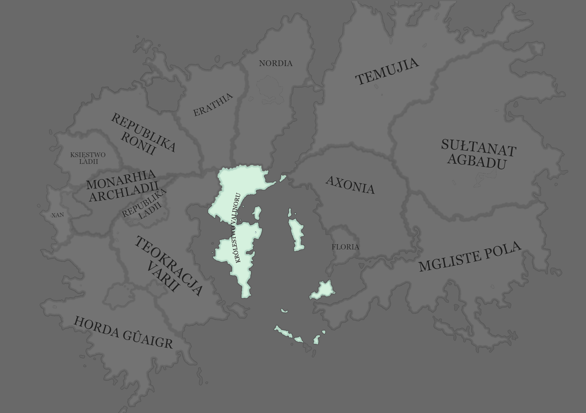

# Królestwo Valinoru

Państwo wyspiarskie panujące bezkonkurencyjnie na morzu błękitnym.

## Geografia

Królestwo składa się z jednego obszernego półwyspu oraz znajdujących się na morzu błękitnym trzech archipelagów

- Smoczej Wyspy
- Nowego Valinoru
- Wyspy Rangrad
  Stolicą państwa jest Valinor, miasto znajdujące się na zwężeniu półwyspu.

Największymi miastami Królestwa Valinoru są:

- Valinor (stolica)
- Dath
- Arienburg
- Vederoth
- Dereth
- Loreth

#### Ustrój

W Królestwie Valinoru panuje monarchia parlamentarna, aczkolwiek w obecnych czasach funkcja króla nie jest już tak mocna jak dawniej.
Państwo należy do jednego ze spokojniejszych w regionie i jest powszechnie uznawane za dobre miejsce do życia.

## Polityka

Państwo utrzymuje przyjazne stosunki w zasadzie ze wszystkimi sąsiadami poprzez fakt, że jest łącznikiem między wschodnim i zachodnim kontynentem. Handel z Valinorem jest o wiele bardziej opłacalny dla trzeźwo myślących krajów niż wojna, a [horda](Horda_Gûaigr.html) znajduje się dostatecznie daleko aby nie stanowić problemu.

## Ciekawostki

- Na niektórych mapach królestwa Valinoru nie uwzględnione są południowe wyspy. Jest to spowodowane tym, że są one do tego stopnia opanowane przez piratów, że niektórzy kartografowie nie uwzględniają ich w swoich mapach.

- W tym państwie rozpoczęła oraz przeżyła większość swoich przygód [Drużyna z Dereth](Drużyna_z_Dereth.html).
