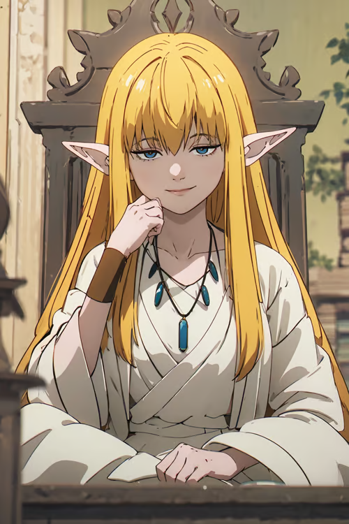

# Lorna

**Lorna** (właściwie to Lorna V Arienburska lub też "Wiedźma z puszczy Dathskiej"), czarodziejka zamieszkująca w leśnej rezydencji na kurzej nóżce, nieopodal miasta Dath. Jest praprawnuczką legendarnej Lorny Inkaustnicy, znanej ze swojej obsesji na punkcie zdobywania wiedzy o magii. Lorna V odziedziczyła po niej swoje zamiłowanie do zgłębiania wszelkiego rodzaju wiedzy magicznej oraz z lekka obsesyjne podejście do tego tematu. 

### Ciekawostki

- Wedle krwi jest 21 kandydatką w kolejce po tron Ladii, jako że pochodzi po ojcu ze starego i szanowanego rodu Talvarenów
- W swojej posiadłości spędzi najbliższe dwa lata, ponieważ zapoczątkowała jej tylko znany rytuał magiczny w jej tylko wiadomym celu, który wymaga ciągłego doglądania, aczkolwiek jako dla elfki czystej krwi nie stanowi to dla niej większego problemu.

