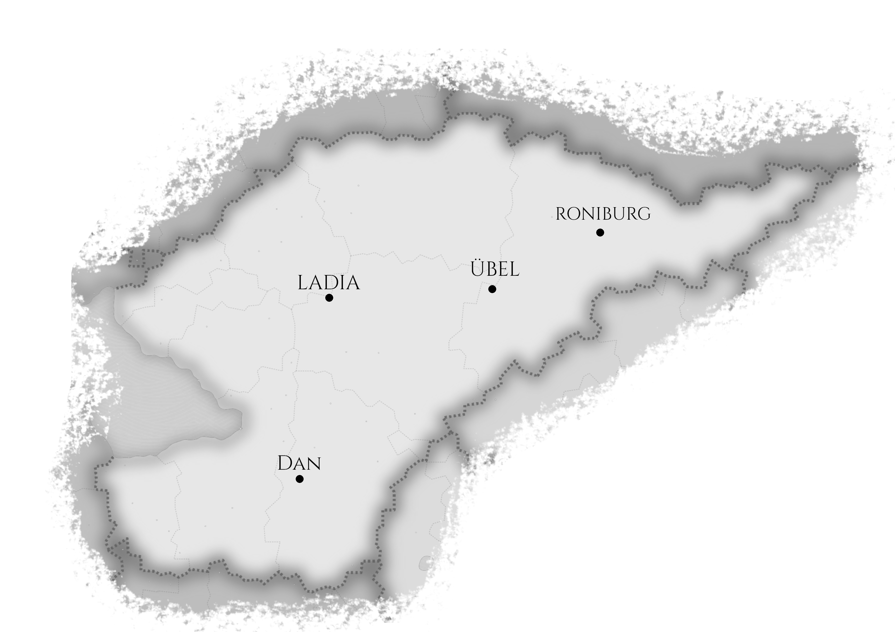

# Monarchia Archladii

Państwo stanowiące niegdyś część Wielkiego Królestwa Ladii, którego rozpad był efektem toczących się od 133 lat wojen Ladijskich.

## Geografia

Największymi miastami w państwie są:

- Ladia (stolica)
- Dan
- Übel
- Roniburg

## Ustrój

W Monarchii Archladii panuje monarchia absolutna, każdy kto próbuje przeciwstawić się królowi zazwyczaj nie kończy dobrze. Państwo ma charakter mocno militarny szykując się nieustannie do wojny z sąsiadami, zwłaszcza z [Republiką Ladii](Republika_Ladii.html), oraz [Księstwem Ladii](Księstwo_Ladii.html).

## Polityka

Relacje Monarchii Archladii z sąsiadami są złe. Państwo patrzy wrogo na każdego otaczającego sąsiada za wyjątkiem pokojowo nastawionego do wszystkich dookoła państwa Xan.

## Ciekawostki

- To w tym państwie swoje przygody rozpoczęła [Drużyna spod Dan](Drużyna_spod_Dan).
