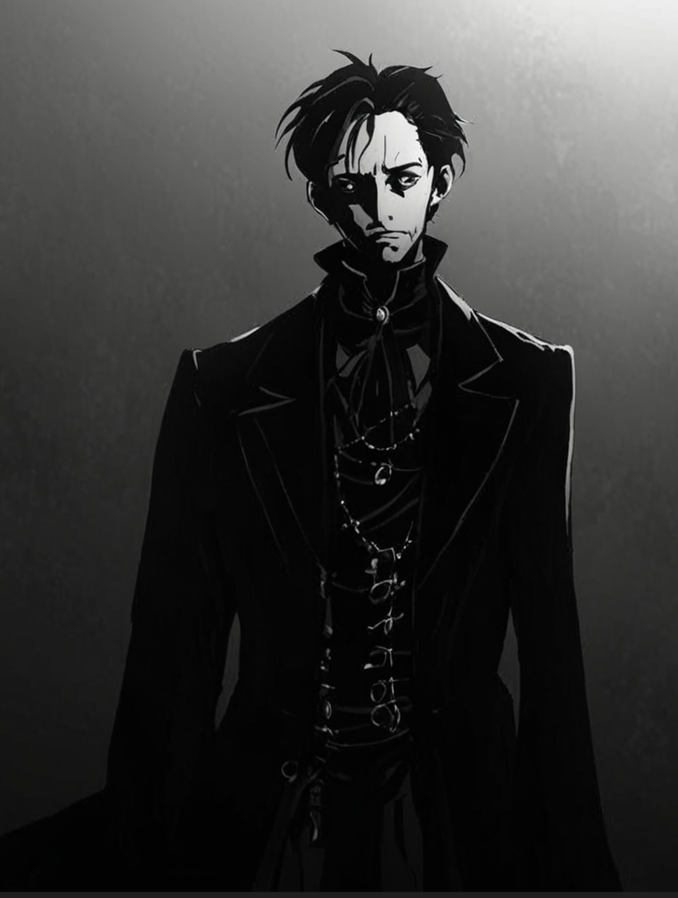

# Taron

**Taron** jest postacią, którą można spotkać w krainie snów. Jest przewodnikiem po snach. Ponury i nie wzbudzający szczególnej sympatii, może pokazać śniącemu jakiś konkretny fragment swojej krainy, ale zazwyczaj nie jest to miłe przeżycie. Spotkania z nim w większości przypadków kończą się przebudzeniem, czy to z powodu śmierci we śnie, czy też otrzymania od Tarona wystarczającej ilości sennych wizji, których celowość jest znana tylko jemu. Nie wiadomo dlaczego senny przewodnik pokazuje przybyszom takie a nie inne rzeczy oraz czy ma to jakikolwiek wpływ na ich życie poza snem.

### Ciekawostki

- Po raz pierwszy został spotkany przez [Wulfharta](Wulfhart.html) i [Ariel](Ariel.html) z [Drużyny z Dereth](Drużyna_z_Dereth.html).

