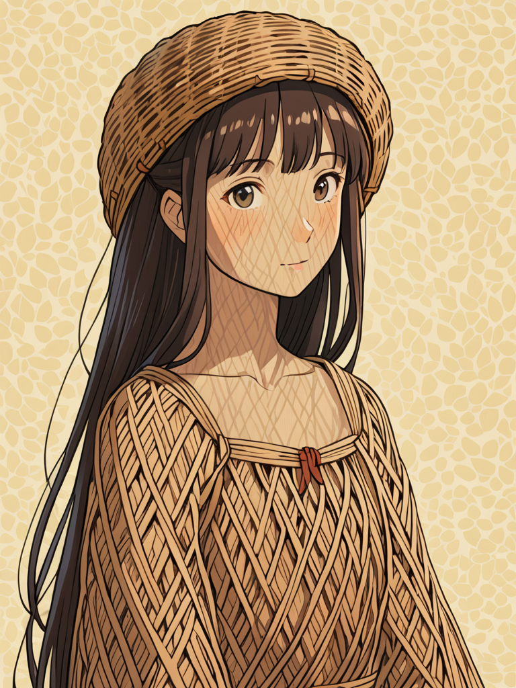

# Śniączka

**Śniączka** (lub też Prządka) jest postacią, którą można spotkać w krainie snów. Zajmuje się pleceniem nocnych wizji i zsyłaniem ich w ładnej, harmonicznie splecionej postaci do głów mieszkańców [Świata](Świat.html) poczas snu. Jest łagodnie usposobiona i ceni sobie spokój oraz wyważenie. Jedyną istotą mogącą wyprowadzić ją z równowagi jest [Kolorowa](Kolorowa.html) oraz inni mieszkańcy kolorowych snów. Całe jej ciało splecione jest z wikliny, a jej włosy są niczym innym jak lnianymi czarnymi nićmi.

### Ciekawostki

- Po raz pierwszy została spotkana przez [Wulfharta](Wulfhart.html) i [Ariel](Ariel.html) z [Drużyny z Dereth](Drużyna_z_Dereth.html).
