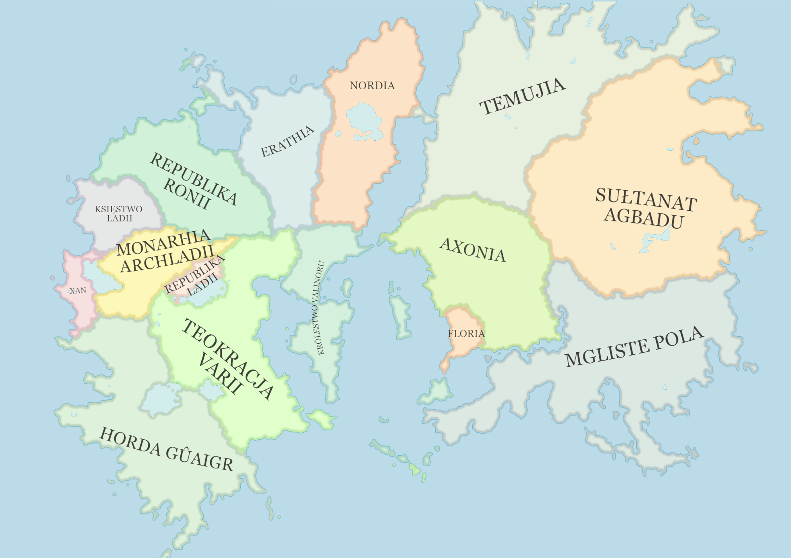

# Świat

Świat, w którym rozgrywają się przygody bohaterów jest przez ogół graczy i nawet samego MG jeszcze niezgłębiony. Dotychczasowe wydarzenia odbywają się na terenach [Królestwa Valinoru](Królestwo_Valinoru.html) oraz [Monarchii Archladii](Monarchia_Archladii.html). Wraz z rozwojem fabuły naszych gier wyobraźni świat będzie coraz lepiej poznany a przygody naszych bohaterów nadadzą mu kształtu i koloru.

## Geografia

Tak zwany "Świat" składa się z dwóch kontynentów, Wschodniego i Zachodniego, oddzielonych trzema morzami. Jedynie na północy, na granicy [Nordii](Nordia.html) i [Temujii](Temujia.html) znajduje się złączenie lądów pozwalające przejść z jednego kontynentu na drugi po suchym lądzie. Poza tym  jedynym środkiem transportu pozwalającym na podróż pomiędzy nimi pozostają okręty.

## Geopolityka

Cały "Świat " podzielony jest politycznie na 15 państw różniących się od siebie klimatem, ustrojem, mieszkańcami i zwyczajami. Więcej o każdym z nich w rozdziale [Państwa](Państwa.html).
